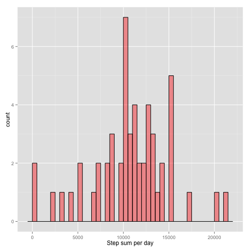
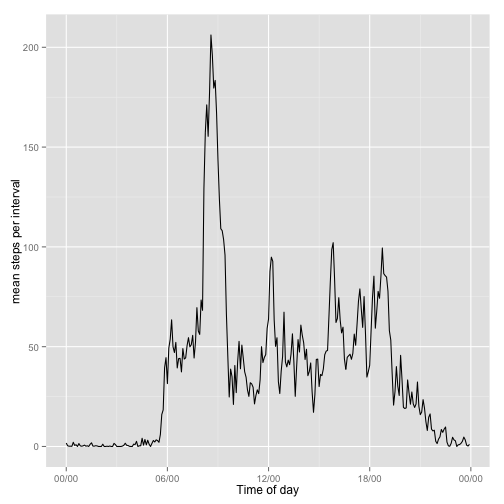
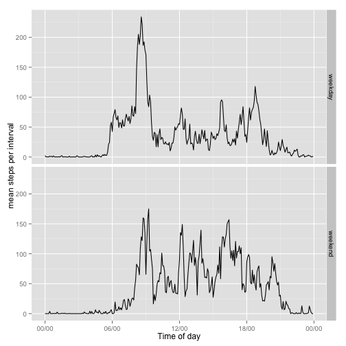

## Loading and preprocessing the data


```r
# load libs
suppressPackageStartupMessages(library(dplyr))
library(ggplot2)
library(knitr)
library(xtable)
library(lubridate)
library(scales)
opts_chunk$set(fig.path='figure/')

# a handy function to determine if a date is a weekend
is.weekend <- function(x)
{
    day_of_week <- wday(x, label = TRUE)
    day_of_week %in% c("Sat", "Sun")
}

# unzipping and reading of data
unzip("activity.zip", overwrite = TRUE)
my_data <- tbl_df(read.csv("activity.csv", stringsAsFactors = FALSE))
```

Let's check on the data quality. A 5-minute interval results in 288 observations per day.


```r
day_count <- my_data %>%
    group_by(date) %>%
    summarize(count = n())
num_off_days <- nrow(day_count[day_count$count != 288,])
num_off_days
```

```
## [1] 0
```

We can see that all days have exactly the expected amount of observations because the list of days with a different number of observations contains 0 elements.

## Imputing missing values

There are some NA values in the data. We can show that if NA values occur, these occur for all measurements of a day because all days showing NA values show 288 NA values.


```r
fail_count <- my_data %>% 
    filter(is.na(steps)) %>%
    group_by(date) %>%
    summarize(count = n())
fail_count$count
```

```
## [1] 288 288 288 288 288 288 288 288
```

The days showing only NA values are not considered at all in further calculation. Just summing them as 0 would bias the results a lot towards 0 while filling them with the overall mean would result in a more dense center of the distribution than actually observed.

For the interpretation of per-interval data in the second part of the analysis about daily activity patterns, the same applies. Not taking these values into account reduces the observations per interval for each interval by the same number of observations and will therefore not add bias to the data.

## What is mean total number of steps taken per day?

First, the data is grouped by day, where the sum of the steps taken in all 5-minute intervals of the day is computed. This results in only 61 data points showing a sum for one day each.


```r
day_sum <- my_data %>% 
    filter(! is.na(steps)) %>%
    select(steps, date) %>%
    group_by(date, drop=TRUE) %>%
    summarize(step_sum = sum(steps))

result <- data.frame(mean = mean(day_sum$step_sum), median = median(day_sum$step_sum))
result
```

```
##       mean median
## 1 10766.19  10765
```

```r
ggplot(day_sum, aes(x = step_sum)) + geom_histogram(alpha = .40, binwidth=500, colour = "black", fill = "red") + xlab("Step sum per day")
```

 

The mean number of steps taken per day is 10766, the median is 10765.

## What is the average daily activity pattern?

To examine this question, the data will be grouped by the interval, summarizing the observations of all days for each interval.


```r
time_mean <- my_data %>%
    filter(! is.na(steps)) %>%
    select(steps, interval) %>%
    group_by(interval) %>%
    summarize(step_mean = mean(steps), time=formatC(first(interval), width=4, format="d", flag="0"))
time_mean$time <- parse_date_time(time_mean$time, "H!M!")
```

```r
ggplot(time_mean, aes(x = time, y = step_mean)) + geom_line() + scale_x_datetime("Time of day", labels = date_format("%H/%M")) + ylab("mean steps per interval")
```

 


## Are there differences in activity patterns between weekdays and weekends?

To distinguish these, the data frame needs to be reconstructed including the information about resulting day


```r
time_mean <- my_data %>%
    filter(! is.na(steps)) %>%
    select(steps, interval, date) %>%
    mutate(weekend = factor(is.weekend(ymd(date)), labels=c("weekday", "weekend"))) %>%
    group_by(interval, weekend) %>%
    summarize(step_mean = mean(steps), time=formatC(first(interval), width=4, format="d", flag="0"))
time_mean$time <- parse_date_time(time_mean$time, "H!M!")
```

```r
ggplot(time_mean, aes(x = time, y = step_mean)) + geom_line() + scale_x_datetime("Time of day", labels = date_format("%H/%M")) + ylab("mean steps per interval") + facet_grid(weekend ~ .)
```

 

As the plots show, there is definitely a difference in the activity patterns between weekdays and weekends.
